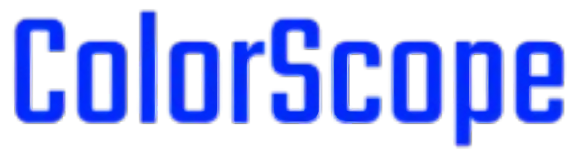

# ColorScope 🎨

A professional UI color palette generator, analyzer, and design tool with advanced color theory algorithms and real-time accessibility testing.



## Table of Contents

- [Features](#features)
- [Technologies](#technologies)
- [Project Structure](#project-structure)
- [Getting Started](#getting-started)
- [Usage Guide](#usage-guide)
- [Color Generation](#color-generation)
- [Mobile Responsiveness](#mobile-responsiveness)
- [Export Formats](#export-formats)
- [Development](#development)

---

## Features

### 🎯 Core Features
- **Palette Generator** - Create harmonious color palettes using 4 different harmony algorithms
- **Image Color Extractor** - Extract dominant colors from uploaded images
- **Contrast Checker** - WCAG compliant accessibility testing for color combinations
- **Gradient Generator** - Create and customize linear and radial gradients
- **Palette Explorer** - Browse and discover trending color schemes
- **Palette Visualizer** - Preview palettes in real-world UI contexts
- **Saved Palettes** - Manage and organize your color libraries (cloud-synced)

### 🎨 Color Generation Modes
1. **UI Design** - Professional color harmonies for web & mobile interfaces
2. **Brand Identity** - Corporate color schemes with primary, secondary, tertiary colors
3. **Illustration** - Creative warm/cool palettes for artwork
4. **Accessibility-First** - WCAG AAA compliant high-contrast palettes

### ♿ Accessibility Features
- Real-time WCAG 2.0 contrast ratio calculation
- AA/AAA compliance indicators with star ratings
- Optimal text color selection (white/black) based on background
- Guaranteed 7:1 contrast ratio mode for strict compliance

### 📱 Mobile-First Design
- Responsive layouts across all screen sizes (mobile, tablet, desktop)
- Touch-optimized interface with hamburger navigation
- Mobile-specific utilities toolbar at bottom
- Full-screen image picker on mobile
- Optimized keyboard shortcuts for desktop

### ☁️ Cloud Features
- Firebase authentication (email/password signup & signin)
- Cloud palette storage with Firestore
- Automatic history synchronization
- User profile management

### ⌨️ Keyboard Shortcuts
| Shortcut | Action |
|----------|--------|
| `Space` | Generate new palette |
| `Ctrl/Cmd + Z` | Undo |
| `Ctrl/Cmd + Shift + Z` | Redo |
| `Ctrl/Cmd + S` | Save palette |
| `ESC` | Close dropdowns/modals |

---

## Technologies

### Frontend
- **Tailwind CSS v4** - Utility-first CSS framework with responsive breakpoints
- **Feather Icons** - Lightweight SVG icon library
- **HTML5/CSS3/Vanilla JavaScript** - No framework dependencies

### Color Theory
- **color-scheme npm package** - Color harmony algorithms
- **Custom HSL/RGB/HEX converters** - Precise color space manipulation
- **WCAG 2.0 contrast calculator** - Accessibility compliance

### Backend & Cloud
- **Firebase v9.22.2**
  - Authentication (custom email/password)
  - Firestore database (palette persistence)
  - Real-time sync
- **LocalStorage** - Browser-based history management

### Color Space Standards
- **HSL (Hue, Saturation, Lightness)** - Generator algorithm base
- **HEX** - User display format
- **RGB** - Luminance calculations
- **WCAG 2.0** - Contrast ratio standards

---

## Project Structure

```
colorScope/
├── index.html              # Main palette generator
├── imagePicker.html        # Image color extraction
├── contrastChecker.html    # Accessibility analyzer
├── gradientGenerator.html  # Gradient creator
├── explorePallete.html     # Palette discovery
├── palletVisualizer.html   # Design preview tool
├── dashboard.html          # Saved palettes manager
├── script.js               # Main application logic (~1500 lines)
├── package.json            # Dependencies
├── assets/                 # Images and icons
│   ├── menu_icon_*.svg     # Navigation icons
│   └── logo.png
├── .git/                   # Version control
└── README.md              # This file
```

### Page Descriptions

| Page | Purpose | Key Features |
|------|---------|--------------|
| `index.html` | Main palette generator | Generate, export, share, undo/redo |
| `imagePicker.html` | Color extraction from images | Upload, drag-to-pick, magnifier tool |
| `contrastChecker.html` | WCAG testing | Ratio calculator, compliance badges |
| `gradientGenerator.html` | Gradient creation | Linear/radial, angle control, preview |
| `explorePallete.html` | Discover palettes | Search, keyword-based, trending |
| `palletVisualizer.html` | Design context preview | Test colors in UI mockups |
| `dashboard.html` | Palette management | Save, delete, export, organize |

---

## Getting Started

### Installation

1. **Clone the repository**
   ```bash
   git clone https://github.com/yourusername/colorScope.git
   cd colorScope
   ```

2. **Install dependencies**
   ```bash
   npm install
   ```

3. **Open in browser**
   - Option A: Use a local server (recommended)
     ```bash
     npx http-server
     # or
     python -m http.server 8000
     ```
   - Option B: Open `index.html` directly in browser

4. **Firebase Setup (Optional - for cloud features)**
   - Create a Firebase project at https://firebase.google.com
   - Replace `firebaseConfig` in `script.js` with your credentials
   - Enable Firestore and Authentication

### Browser Requirements
- Modern browser with ES6+ support
- LocalStorage enabled
- Cookies enabled (for Firebase auth)

---

## Usage Guide

### 1. Generate Color Palettes

**Desktop:**
- Click the dropdown to select palette type
- Press `Space` bar to generate new colors
- Click on any color to copy to clipboard

**Mobile:**
- Tap hamburger menu in top-left
- Select desired palette type
- Tap "Generate" button at bottom

### 2. Extract Colors from Images

1. Go to **Image Picker**
2. Upload or browse for an image
3. Click on any part of the image to pick colors
4. Use the magnifier for precision picking
5. Export the extracted palette

### 3. Test Accessibility

1. Go to **Contrast Checker**
2. Set text color and background color
3. View contrast ratio and WCAG compliance
4. Check AA/AAA badges
5. Adjust colors to meet your needs

### 4. Create Gradients

1. Go to **Gradient Generator**
2. Select gradient direction (90°, 180°, 270°, 360°)
3. Adjust color stops with sliders
4. Preview in real-time
5. Export as CSS or image

### 5. Save Your Palettes

1. Generate a palette you like
2. Click the heart icon to save
3. Saved palettes sync to cloud (if logged in)
4. Access from Dashboard
5. Export in multiple formats

---

## Color Generation

### Algorithm Details

#### 1. UI Design Palettes
Generates professional harmonies using color theory:
- **Complementary**: Opposite colors on color wheel (180°)
- **Triadic**: 3 evenly spaced colors (120° apart)
- **Analogous**: Adjacent colors (30° spacing)
- **Split-Complementary**: Base + two offset complement colors

**Parameters:**
```javascript
Saturation: 50-80%
Lightness: 40-70%
Hue range: 0-360° (random base)
Color count: 2-10 adjustable
```

#### 2. Brand Identity Palettes
Generates cohesive corporate color schemes:
- **Primary**: Bold, saturated main color (65-85% saturation)
- **Secondary**: Complementary harmony derivative
- **Tertiary**: Accent variations for depth

#### 3. Illustration Palettes
Creative color sets for artwork:
- **Warm palette**: 0-60°, 300-360° hues with vibrant saturation
- **Cool palette**: 180-270° hues with artistic variations
- **Higher saturation** for visually striking results

#### 4. Accessibility Palettes
WCAG AAA compliant sets:
- **Dark colors**: 20-25% lightness for high contrast
- **Light colors**: 85-90% lightness for readability
- **Guaranteed**: 7:1+ contrast ratio on all pairs

### Color Space Conversions

```javascript
// HSL → HEX
hslToHex(hue, saturation, lightness) → "#RRGGBB"

// HEX → HSL
hexToHsl(hex) → [hue, saturation, lightness]

// Contrast Calculation (WCAG 2.0)
getContrastRatio(color1, color2) → ratio (1-25)

// Optimal Text Color
getOptimalTextColor(backgroundColor) → "#ffffff" | "#000000"
```

---

## Mobile Responsiveness

### Responsive Breakpoints

```css
Mobile: 0-639px (base styles)
sm:     640px+   (minor adjustments)
md:     768px+   (major layout changes)
lg:     1024px+  (multi-column layouts)
xl:     1280px+  (full desktop experience)
```

### Mobile-Specific Features

| Feature | Mobile | Desktop |
|---------|--------|---------|
| Navigation | Hamburger sidebar | Dropdown menu |
| Color Palette | Rows (h-20) | Columns (h-[76vh]) |
| Utilities | Fixed bottom bar | Integrated layout |
| Image Picker | Image top → Utilities | Side-by-side |
| Dropdowns | Full-screen width | Constrained width |

### Layout Patterns

**Top Navigation (Sticky)**
- Hamburger menu button (left)
- ColorScope logo (center)
- Desktop nav tools (right, hidden on mobile)

**Color Palette Display**
- Mobile: Horizontal rows stacked vertically with short height
- Desktop: Horizontal row with very tall columns

**Bottom Utility Bar (Mobile)**
- Generate button (left)
- Copy, Info, Share, Menu buttons (right)
- Fixed position, visible while scrolling

---

## Export Formats

### Supported Export Formats

1. **CSS Variables** (`:root {}`)
   ```css
   :root {
     --color-0: #D4AE3A;
     --color-1: #4F72D8;
     --color-2: #7AB8D6;
   }
   ```

2. **JSON** (Structured data)
   ```json
   {
     "colors": ["#D4AE3A", "#4F72D8", "#7AB8D6"],
     "name": "UI Design Palette",
     "harmony": "triadic"
   }
   ```

3. **Adobe ASE** (Swatch file for design tools)
   - Import directly into Photoshop, Illustrator, Figma
   - Binary format optimized for Adobe products

4. **Shareable URL**
   - Copy link to share palette
   - Includes color data in query parameters
   - No sign-in required to view

---

## Development

### Project Architecture

**Module Pattern (IIFE-based Controllers)**
```javascript
// Each controller is self-contained
const NavigationController = (() => {
  // Private variables
  let state = {};
  
  // Public API
  return {
    init,
    updateUser,
    // ...
  };
})();
```

**Data Flow**
```
User Input → Event Handler → State Update → DOM Render → Visual Output
```

**State Management**
```javascript
state = {
  currentPalette: { colors, name, harmony },
  history: [...palettes],      // localStorage synced
  historyIndex: number,         // undo/redo position
  colorCount: 5-10,            // adjustable
  paletteType: 'ui-design',    // 4 types
  isGenerating: boolean        // debounce flag
}
```

### Key Functions

```javascript
// Color Generation
generateNewPalette()           // Main generation entry point
generateUIDesignPalette()      // UI harmony
generateBrandIdentityPalette() // Brand colors
generateIllustrationPalette()  // Creative sets
generateAccessibilityPalette() // WCAG compliant

// Color Utils
hslToHex(h, s, l)             // Color space conversion
hexToHsl(hex)                 // Inverse conversion
getContrastRatio(c1, c2)      // WCAG contrast
getOptimalTextColor(bg)       // Readable text color

// History Management
addToHistory(palette)         // Add to undo/redo
undo()                        // Go back
redo()                        // Go forward

// Export/Import
exportPalette(format)         // CSS, JSON, ASE, URL
importPalette(data)           // Load palette data
savePalette()                 // Cloud sync
```

### Browser DevTools Tips

```javascript
// Test palette generation
navigator.colorScope.generateUIDesignPalette(45, 5)

// Check current state
navigator.colorScope.state

// Manual undo/redo
navigator.colorScope.undo()
navigator.colorScope.redo()

// Copy palette to clipboard
navigator.colorScope.sharePalette()
```

### Contributing

1. Fork the repository
2. Create a feature branch (`git checkout -b feature/improvement`)
3. Commit changes (`git commit -am 'Add improvement'`)
4. Push to branch (`git push origin feature/improvement`)
5. Open a Pull Request

### Future Improvements

- [ ] Color blindness simulation modes
- [ ] AI-powered palette suggestions
- [ ] Advanced gradient editor with color stops
- [ ] Palette sharing with collaboration features
- [ ] Dark mode support
- [ ] PWA offline support
- [ ] WebGL-based image processing
- [ ] Color animation preview
- [ ] Design system exporter (Figma tokens)
- [ ] Multi-language support

---

## Keyboard Shortcuts Reference

### Desktop Only
- `Space` - Generate new palette
- `Ctrl/Cmd + Z` - Undo
- `Ctrl/Cmd + Shift + Z` - Redo
- `Ctrl/Cmd + S` - Save current palette
- `ESC` - Close menus/modals

### Mobile
- Tap "Generate" button at bottom
- Swipe navigation menu
- Use on-screen controls

---

## Accessibility & Performance

### WCAG Compliance
- Accessible color contrast throughout UI
- Keyboard navigation support
- ARIA labels and semantic HTML
- Screen reader friendly navigation

### Performance Optimizations
- Lazy loading of non-critical resources
- Debounced palette generation (100ms)
- Efficient DOM updates
- LocalStorage caching
- CDN resources (Tailwind, Feather Icons)

---

## Browser Support

| Browser | Version | Status |
|---------|---------|--------|
| Chrome | Latest | ✅ Full support |
| Firefox | Latest | ✅ Full support |
| Safari | Latest | ✅ Full support |
| Edge | Latest | ✅ Full support |
| Mobile Safari | 12+ | ✅ Full support |
| Chrome Mobile | Latest | ✅ Full support |

---

## License

This project is open source and available under the MIT License.

---

## Support & Contact

For questions, issues, or feature requests:
1. Open an issue on GitHub
2. Check existing documentation
3. Review code comments for implementation details

---

## Credits

- **Color Theory**: Based on traditional color harmony principles
- **Icons**: Feather Icons by Cole Bemis
- **Styling**: Tailwind CSS by Tailwind Labs
- **Backend**: Firebase by Google
- **Inspiration**: Professional design tools like Adobe Color, Figma, Coolors

---

**Made with 🎨 for designers and developers**

Last Updated: March 8, 2026
